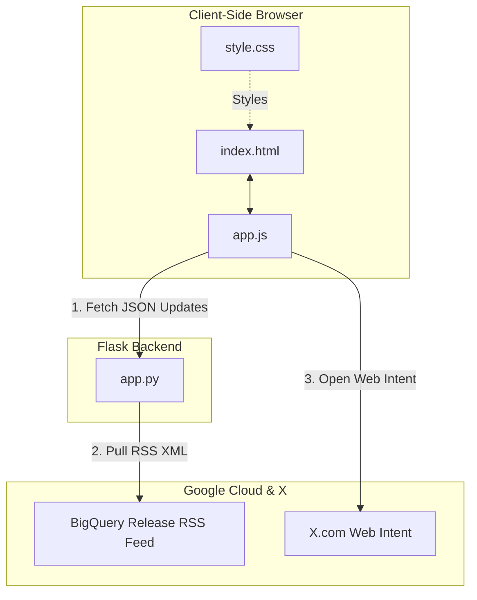
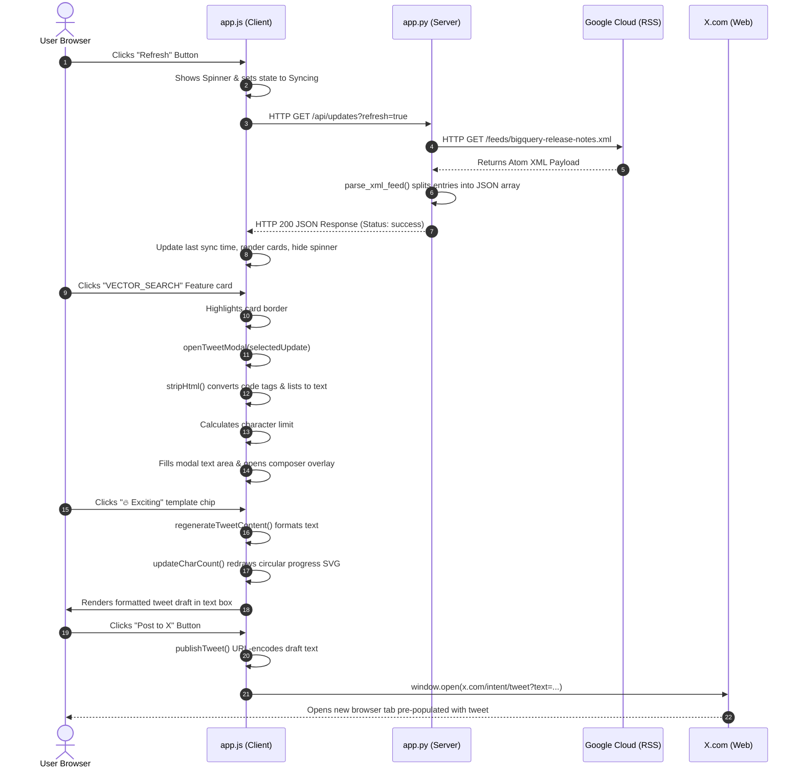

# Project Architecture & Request-Response Flow

This document provides a detailed walkthrough of the **BigQuery Release Notes Tracker & Tweet Composer** application, dividing it into its server-side and client-side systems and tracking a sample user interaction flow.

---

## 1. System Overview & Core Features

The application operates as a **single-page dashboard (SPA)** with a lightweight Flask JSON API backend. It retrieves live developer update feeds, processes them into granular cards, and formats them into Twitter-friendly texts.

### Key Features
- **RSS Parser Splitter**: Instead of showing long daily logs, the parser splits updates by category tags (e.g. `Feature`, `Change`, `Deprecation`) so they can be processed and tweeted individually.
- **Client-Side Search & Filter**: Instant filtering based on title, content, or type without repeating remote API network requests.
- **Smart Truncator**: Limits character outputs to exactly 280, accommodating variable length URLs, tags, and custom templates.
- **Web Intent Publishing**: Pre-fills drafts on X/Twitter using secure, client-side browser links without requiring OAuth configurations.
- **CSV Data Exporter**: Export whatever updates are currently active and filtered on the screen to a `.csv` file format.
- **Dark/Light Theme Toggle**: Seamless style swapping with variable overriding and LocalStorage persistence.
- **Keyboard Power-User Navigation**: Hotkey controls (ArrowKeys, j/k, Enter, Space, Escape, /) to navigate, search, open composer, and post without touching the mouse.

---

## 2. Codebase Structure

- [app.py](file:///Users/tomhr/AG_Workspaces/5dgi/agy-cli-projects/bq-release-notes/app.py) - Flask backend server (routing, fetching, XML parsing, cache).
- [templates/index.html](file:///Users/tomhr/AG_Workspaces/5dgi/agy-cli-projects/bq-release-notes/templates/index.html) - Single-page HTML structure (layouts, sidebar, modals, badges).
- [static/css/style.css](file:///Users/tomhr/AG_Workspaces/5dgi/agy-cli-projects/bq-release-notes/static/css/style.css) - Vanilla CSS styling (dark design tokens, responsive grid, animations).
- [static/js/app.js](file:///Users/tomhr/AG_Workspaces/5dgi/agy-cli-projects/bq-release-notes/static/js/app.js) - Client-side state controller (event listeners, filtering, modal composer, string handlers).

---

## 3. Server-Side vs. Client-Side Breakdown



### A. Server-Side (Flask Backend)
The backend in [app.py](file:///Users/tomhr/AG_Workspaces/5dgi/agy-cli-projects/bq-release-notes/app.py) is kept lean. It acts as a CORS-friendly proxy, feed parser, and cache.

1.  **Feed Parser ([`parse_xml_feed`](file:///Users/tomhr/AG_Workspaces/5dgi/agy-cli-projects/bq-release-notes/app.py#L17))**:
    *   Parses the Atom XML namespace (`http://www.w3.org/2005/Atom`) using python's `xml.etree.ElementTree`.
    *   Extracts entry metadata (title, updated timestamp, alternate links).
    *   Inspects the HTML CDATA payload of `<content>`. It uses regular expressions to find all `<h3>` tags (which denote update classifications like "Change" or "Feature").
    *   Splits the content into separate update chunks and maps them to unique IDs (e.g. `[entry_id]#[type]-[index]`).
2.  **Caching Mechanism ([`get_updates`](file:///Users/tomhr/AG_Workspaces/5dgi/agy-cli-projects/bq-release-notes/app.py#L86))**:
    *   Keeps a global in-memory Cache dictionary (`_feed_cache`) containing parsed updates, response ETags, and Last-Modified timestamps.
    *   Saves network bandwidth and rate limits by sending headers `If-None-Match` and `If-Modified-Since` to Google's server.
    *   If Google returns status code `304 Not Modified`, Flask serves the cached dataset instantly.
    *   Allows manual bypass when the client sends `?refresh=true`.

### B. Client-Side (HTML / CSS / JS)
The frontend handles layout presentation, filtering, and text manipulation.

1.  **Layout System ([style.css](file:///Users/tomhr/AG_Workspaces/5dgi/agy-cli-projects/bq-release-notes/static/css/style.css))**:
    *   Uses a split screen design: a fixed `300px` control sidebar on the left and a scrollable content area on the right.
    *   Supports responsive layouts (collapses to a single vertical column on viewports `< 900px`).
    *   Applies a dark-blue glassmorphism theme (`backdrop-filter`) with custom indicator glowing effects.
    *   **Light Theme Variables**: Swaps root colors, gradients, shadows, and backgrounds when the `body.light-theme` class is applied.
2.  **Interactive Controller ([app.js](file:///Users/tomhr/AG_Workspaces/5dgi/agy-cli-projects/bq-release-notes/static/js/app.js))**:
    *   **State Tracker**: Manages the loaded datasets (`updatesState`), search terms, type filters, sort state, keyboard index, and selected update.
    *   **Real-time Renderers**: [`applyFilters`](file:///Users/tomhr/AG_Workspaces/5dgi/agy-cli-projects/bq-release-notes/static/js/app.js#L250) filters and sorts cards instantly using javascript `Array.prototype.filter()` and `Array.prototype.sort()`.
    *   **HTML Stripper ([`stripHtml`](file:///Users/tomhr/AG_Workspaces/5dgi/agy-cli-projects/bq-release-notes/static/js/app.js#L332))**: Formats parsed HTML elements into clean, readable text. Lists are converted to markdown bullet points (`• item`) and paragraph breaks are preserved as newlines (`\n\n`).
    *   **Character Budget Allocator ([`regenerateTweetContent`](file:///Users/tomhr/AG_Workspaces/5dgi/agy-cli-projects/bq-release-notes/static/js/app.js#L354))**: 
        *   Calculates the static characters used by the selected layout style (e.g. "Exciting" adds emojis and hashtags).
        *   Determines `maxSummaryLength = 280 - staticLength`.
        *   Truncates the core release text to this size, appending `...` if needed.
        *   Updates an interactive SVG circle indicator ([`updateCharCount`](file:///Users/tomhr/AG_Workspaces/5dgi/agy-cli-projects/bq-release-notes/static/js/app.js#L396)) to show character warnings (yellow at <=30 characters remaining, red at <0).
    *   **Data Export ([`exportToCSV`](file:///Users/tomhr/AG_Workspaces/5dgi/agy-cli-projects/bq-release-notes/static/js/app.js#L588))**: Maps currently filtered cards to an array of rows, double-escapes quotes for CSV compatibility, packages it as a Blob, and downloads it in the browser.
    *   **Theme Switcher ([`toggleTheme`](file:///Users/tomhr/AG_Workspaces/5dgi/agy-cli-projects/bq-release-notes/static/js/app.js#L567))**: Toggles theme classes on the document body and saves state to LocalStorage for persistence.
    *   **Keyboard Navigation ([`handleGlobalKeydown`](file:///Users/tomhr/AG_Workspaces/5dgi/agy-cli-projects/bq-release-notes/static/js/app.js#L489))**: Standardizes hotkey bindings, resolves focused indices, scrolls cards into view, and disables navigation triggers when typing in text fields.

---

## 4. Sample Flow: "Clicking, Customizing, and Tweeting a Release Note"

The diagram below tracks the sequence of events when a user selects a "Feature" release note, formats it into an "Exciting" tweet, and posts it.



### Request & Response Payload Examples

#### 1. API Fetch Call
*   **Request**: `GET /api/updates?refresh=true`
*   **Response Headers**: `Content-Type: application/json`
*   **Response Payload**:
    ```json
    {
      "status": "success",
      "source": "live",
      "updates": [
        {
          "id": "tag:google.com,2016:bigquery-release-notes#June_25_2026#Feature-1",
          "date": "June 25, 2026",
          "updated": "2026-06-25T00:00:00-07:00",
          "type": "Feature",
          "link": "https://docs.cloud.google.com/bigquery/docs/release-notes#June_25_2026#Feature-1",
          "content": "<p>You can now use the <a href=\"...\"><code>VECTOR_SEARCH</code> function</a> to combine a semantic search with a lexical (keyword) search...</p>"
        }
      ]
    }
    ```

#### 2. Tweet Formatting Output (Exciting Template)
*   **Raw Content extracted from HTML**: 
    `You can now use the VECTOR_SEARCH function to combine a semantic search with a lexical (keyword) search.`
*   **Static Template String**:
    ```text
    🔥 New BigQuery Feature! (June 25, 2026)

    👉 [SummaryText]

    Read more: https://docs.cloud.google.com/bigquery/docs/release-notes#June_25_2026#Feature-1
    #BigQuery #GoogleCloud #DataEngineering
    ```
*   **Compiled Tweet sent to X**:
    ```text
    🔥 New BigQuery Feature! (June 25, 2026)

    👉 You can now use the VECTOR_SEARCH function to combine a semantic search with a lexical (keyword) search.

    Read more: https://docs.cloud.google.com/bigquery/docs/release-notes#June_25_2026#Feature-1
    #BigQuery #GoogleCloud #DataEngineering
    ```
*   **X Web Intent URL Call**:
    `https://x.com/intent/tweet?text=%F0%9F%94%A5%20New%20BigQuery%20Feature!...`

---

## 5. Keyboard Navigation Hotkeys Map

When navigating the interface, the following keyboard shortcut mappings are resolved by [`handleGlobalKeydown`](file:///Users/tomhr/AG_Workspaces/5dgi/agy-cli-projects/bq-release-notes/static/js/app.js#L489):

| Context / State | Hotkey | Bound Event / Action |
| :--- | :--- | :--- |
| **Global Feed** | `ArrowDown` or `j` | Moves focus highlight to the next card in the list (auto-scrolls) |
| **Global Feed** | `ArrowUp` or `k` | Moves focus highlight to the previous card (auto-scrolls) |
| **Global Feed** | `Enter` or `Space` | Selects focused card and opens the Tweet Composer Modal |
| **Global Feed** | `/` (Slash) | Focuses the Search Input box and highlights text |
| **Global Feed** | `Escape` | Clears active keyboard focus highlight |
| **Search Input Box** | `ArrowDown` | Blurs search box and transfers focus control to the first card |
| **Search Input Box** | `Escape` | Clears search text, resets feed, and blurs input field |
| **Composer Modal** | `Escape` | Closes composer modal, restores focus outline to the active card |
| **Composer Modal** | `Cmd + Enter` or `Ctrl + Enter` | Direct X Publishing: Submits tweet and opens X Web Intent tab |
